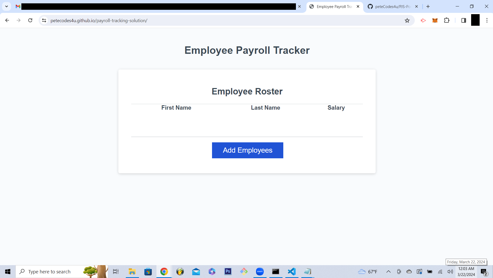

# <Payroll Tracking Solution>

## Description

This project has been developed to solve for collecting and organizing employee data in a dynamic array and using javascript to calculate the average of employee salaries that are accumulated when using the application functions.    

## Table of Contents

- [Usage](#usage)
- [Credits](#credits)

## Link to Website

## Usage

The intended usage of this application is to organize employee data by collecting emplyee names and salary information. 

## Features

- User prompt to collect employee's first name
- User prompt to collect employees second name.
- User prompt to collect employees salary.
- Average Salary calculator (located in the devTools console).
- Random employee selector (located in the devTools console).
- Navigation menu link "Resume" will trigger a download of Peter's Resume. 
- User prompt to collect another employee.

## Front End Manual Tests
 
 **Feature - User Prompts (First Name, Last Name Salary)**
 
 **GIVEN :** the webpage loads successfully.
 
 **WHEN :** the user clicks on the Add Employee button.
 
 **THEN :** the user propt "Please enter the employee's (first name || last name || salary)" is rendered and functional.

##

 **Feature - User prompt Add Another Employee**

 **GIVEN :** the webpage loads successfully.  
 
 **WHEN :** the user completes the employee's salary entry.
 
 **THEN :** the Add another employee confirmation prompt is rendered and functional. 

##

 **Features - Average Salary Calculator**

 **GIVEN :** The webpage loads successfully and the user successfully enters an employee's data.
 
 **WHEN :** the user opens the devTools in Chrome (f12).
 
 **THEN :** the user can see the average salary calculated.

##

 **Feature - Random employee selector**

 **GIVEN :** The webpage loads successfully and the user successfully enters an employee's data.
 
 **WHEN :** the user opens the devTools in Chrome (f12).
 
 **THEN :** the user can see a meesage indicating the random employee selected.
